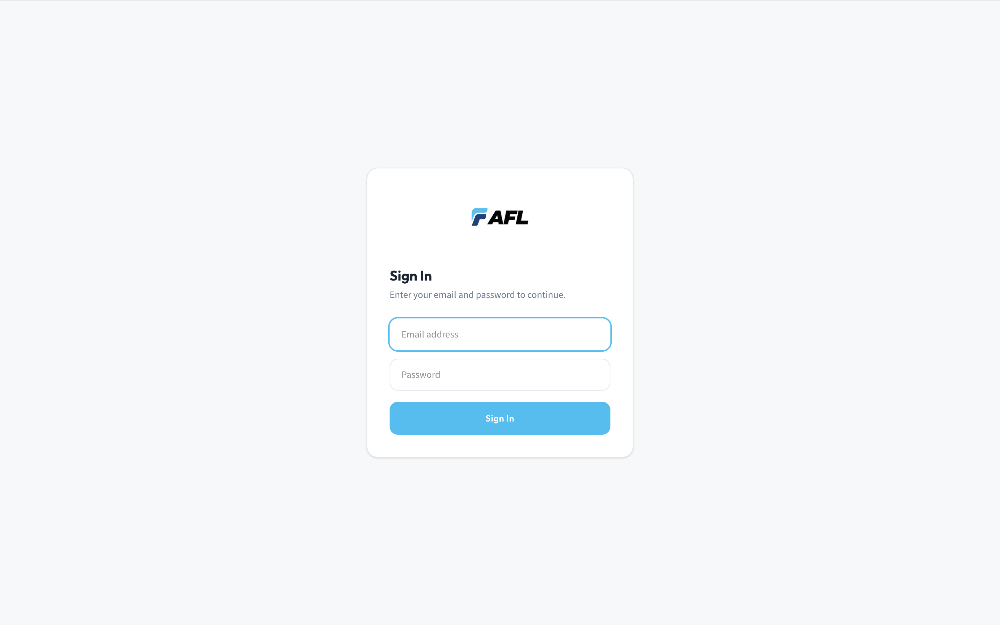
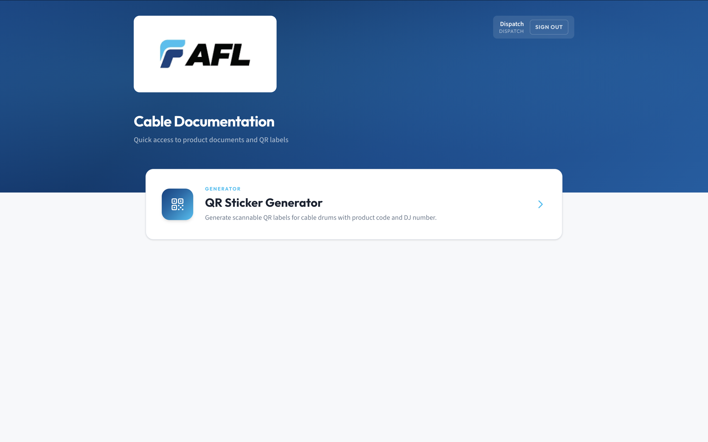
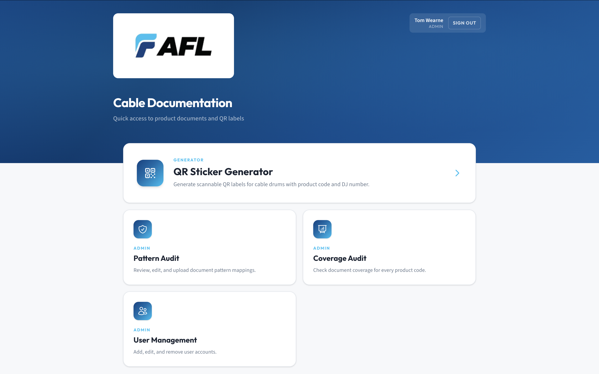
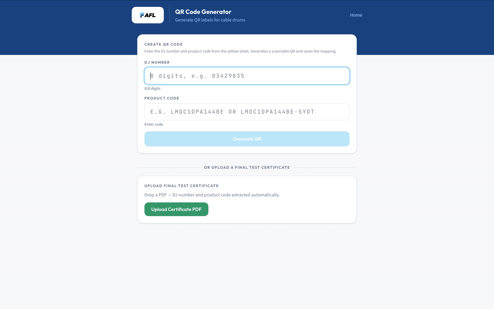
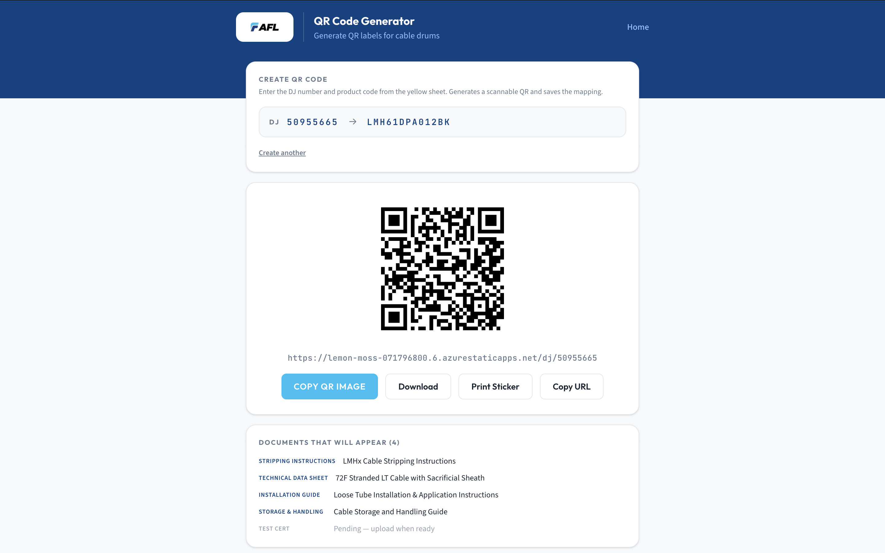
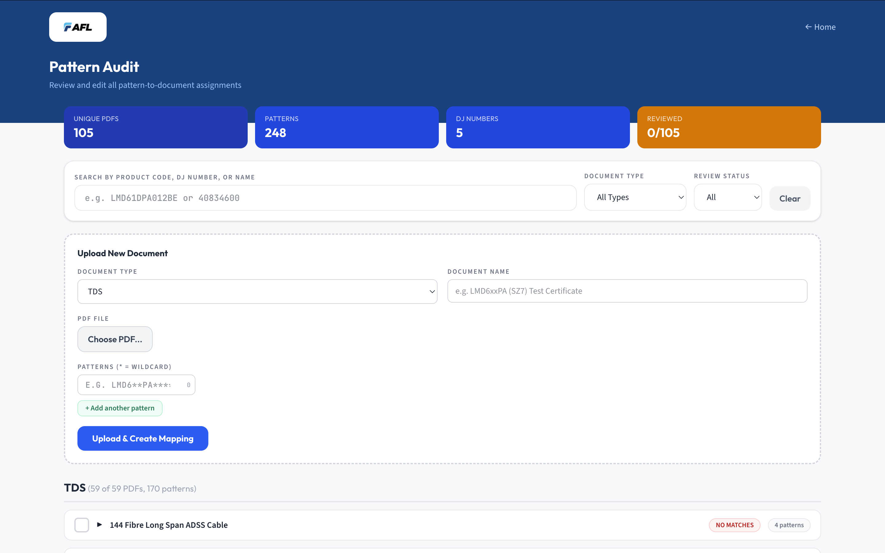
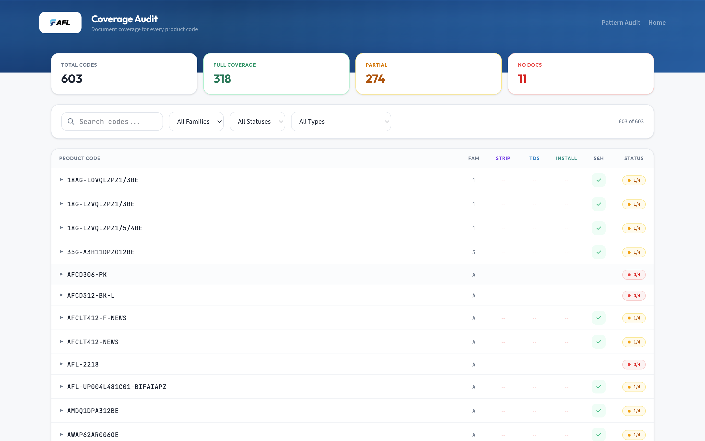
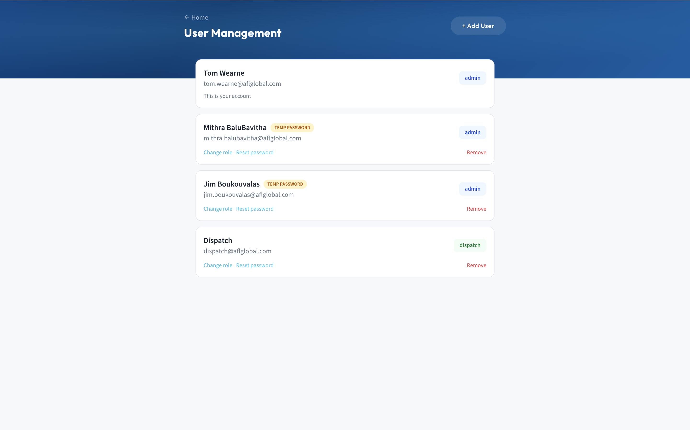
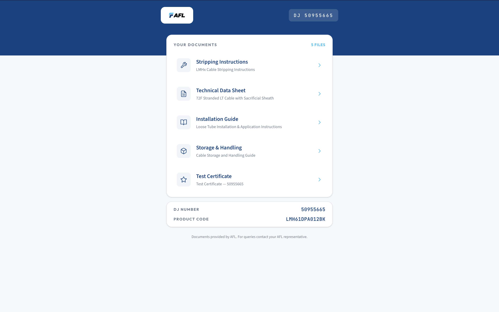

# Visual Walkthrough — AFL Cable Docs

A screen-by-screen tour of the app as used in production. Read this after HANDOVER-BRIEF.md and before diving into the code.

Screenshots live in [`docs/screenshots/`](./docs/screenshots/) and are embedded below.

---

## 1. Login

The one public entry point for the authenticated surface. JWT-backed, session-scoped (clears on browser close). First login forces a password change.

---

## 2. Home — Dispatch view

Dispatch sees a single card: the QR Sticker Generator. Nothing else is surfaced — they don't need anything else.

Top-right: the user chip showing signed-in name, role, and a Sign Out button.

---

## 3. Home — Admin view

Admins see four cards: QR Generator (primary), Pattern Audit, Coverage Audit, User Management. Same signed-in chip top-right.

---

## 4. Generate — Dispatch view

Two sections, top to bottom:
- **Create QR Code** (primary) — DJ number + product code, click Generate QR.
- **Upload Final Test Certificate** — drop a cert PDF, DJ + product code auto-extracted.

Nothing else. Deliberately minimal for the yellow-sheet workflow.

---

## 5. Generate — Admin view

Admins see the same two sections as dispatch **plus a third middle section** labelled *"Or look up an existing DJ"*. That middle panel lets admins resolve an already-mapped DJ, see the docs that would appear, and add/remove per-DJ document overrides.

_(Screenshot not captured; mentally insert a panel between sections 1 and 2 of the dispatch view above, with a DJ-number input and an inline override editor.)_

---

## 6. Generate — QR rendered

After clicking **Generate QR**, the QR image, its target URL, docs preview, and action buttons render inline: **Copy QR Image** (writes a PNG to the system clipboard), **Download**, **Print Sticker**, **Copy URL**. Copy QR Image is the button dispatch actually uses day-to-day — they paste straight into their label template.

---

## 7. Pattern Audit (admin only)

Where document-to-product-code patterns are reviewed and edited. Full CRUD on `document-map.json`. Filters by type (TDS, Stripping, Installation, Other), search by pattern or document name.

Top banner shows at-a-glance counts: unique PDFs, total patterns, known DJ numbers, review status.

---

## 8. Coverage Audit (admin only)

Loads every product code the app knows about, runs `findDocuments()` against each, and flags codes missing any document type. Useful before a release to verify no customer ships without the right docs behind their QR.

Top cards summarise: total codes / full-coverage / partial / no-docs.

---

## 9. User Management (admin only)

List, create, edit, delete users. Role dropdown (`dispatch` / `admin`), password reset inline (forces change-on-next-login). New accounts are tagged **TEMP PASSWORD** until the user signs in and changes it.

---

## 10. Public QR scan — by DJ number (with cert attached)

What the customer sees when they scan the sticker on a drum. No login. Clean, mobile-first layout: logo header, DJ badge, a card listing every document for that order (TDS, Stripping, Installation, Storage & Handling, and the Final Test Certificate once uploaded). Tapping a card opens the PDF directly from Blob Storage.

Reached via `/dj/<djNumber>`. This is the "real" scan URL; every newly-printed sticker points here.

If the cert hasn't been uploaded yet, the Test Certificate row shows *"Pending — upload when ready"* instead of a link. The printable QR is still useful pre-cert.

---

## Known gap: bulk cert upload

`/upload` (the bulk Final Test Certificate upload page) was reported as **not working reliably** during the final handover smoke test. The single-cert upload from `/generate` is still functional and is the primary path today. Worth the US team investigating the bulk flow early — likely a client-side bug in the sequential upload loop in `src/pages/UploadPage.jsx`.

---

## How to capture these screenshots

For the US team (or any future maintainer) to regenerate this walkthrough:

1. Log into the deployed app with both a dispatch and an admin account.
2. Capture each screen at roughly 1440×900 viewport.
   - macOS: `Cmd+Shift+4` drag to select, or `Cmd+Shift+5` for the tool UI.
   - Set the default save location with `defaults write com.apple.screencapture location <path>; killall SystemUIServer`.
3. Save to `docs/screenshots/NN-<name>.png` using the filenames referenced above.
4. Commit the PNGs.
5. Optionally export this markdown to PDF via VS Code's markdown preview → print-to-PDF, or GitHub's preview → print, to attach to handover emails.

The markdown file references images by relative path, so dropping files in place "turns on" each image with no edits needed here.
